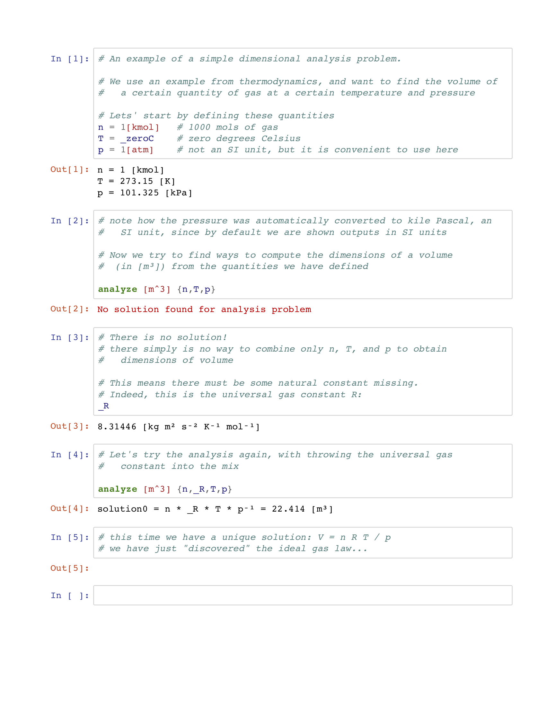

# DACalc --- A calculator for Dimensional Analysis


Dimensional Analysis refers to the analysis of physical quantities using their *units* or *dimensions*. At the core, DACalc is essentially a calculator with units. It keeps track of the units of physical quantities (also called *concrete numbers*), and ensures that we do not perform calculations that are physically meaningless, like adding a length to a velocity, or, more subtly, adding a mass and a force. In doing so, DACalc helps to find and eliminate many sources of error in physical calculations. It also effortlessly converts between different units, including both SI units and US units.

Finally, DACalc performs actual Dimensional Analysis of multiple quantities, to figure out how to combine them to obtain a value of a certain target dimension. This can be used to deepen the understanding of a physical problem and "discover" laws of physics.

## Contents

- [Basic Calculations with DACalc](#basics)
- [Introduction to Physical Dimensions and Units](#dimensions)
- [Dimensional Analysis](#da)
- [Python API](#python)
- [More Info](#more)


## Basic Calculations with DACalc<a name="basics"></a>

Let's start with a simple example that demonstrates how DACalc can be used to calculate a torque value in various units. 


Generally DACalc supports all types of mathematical operators (including `^` for integer exponents and `%` for integer roots). It also supports the standard math library functions. For units, DACalc comes predefined with all SI units and SI prefixes, as well as with a large number of US units. As we have already seen, it is also possible to define new custom units to simplify certain domain specific calculations. For example, if we do relativistic calculations, we may want to define the speed of light and the light year as units:

```Python
def c _c           # the speed of light is already a predefined constant, but now we make it a unit
def ly 365.25[d c] # note that we can now use the new unit [c] in the unit string
```

## Introduction to Physical Dimensions and Units <a name="dimensions"></a>

Now that we have seen some simple examples, let's dig deeper into the basics of physical dimensions and units.
Any physical quantity can be expressed as a combination of the seven base quantities

- mass (in units such as kilogram \[kg\] or pound \[lb\])
- length (e.g. in metre \[m\] or inch \[in\])
- time (e.g. in seconds \[s\] or \[min\])
- current (in Ampere \[A\])
- temperature (e.g. Kelvin \[K\], or degree Rankine \[degR\])
- amount of substance (i.e. the number of atoms or molecules in Mole \[mol\] or pound mole \[lbmol\])
- luminous intensity (e.g. in Candela \[cd\] or foot-candles \[fc\])

The *dimensions* of a physical quantity are the set of powers of the base quantity needed to represent it. 
For example, a volume has dimensions of `length³`, velocity has dimensions of `length¹ * time⁻¹`, and a force has dimensions `mass¹ * length¹ * time⁻²`.

Critically, we can only add and subtract quantities that have the same dimensions, a property that is called *dimensional homogeneity*. We can multiply (divide) arbitrary quantities, in which case their dimensions get added (subtracted). We can raise a quantity to any (integer) power, but we can only take (integer) roots if doing so results in integer dimensions. For example, we can take the square root of an area, or the cube root of a volume, yielding a length in both cases, but we cannot the square root of a volume since this is not a physically meaningful quantity.

Most math library functions like `exp`, `pow`, `sin`, `acos` etc. only make physical sense with *unitless* quantities, i.e. quantities where the exponents for all base quantities are 0. Note however, that angles and solid angles have a special role, which we discuss next.


### Angles and Solid Angles

Angles and solid angles have a special status in that they are technically unitless quantities. For example, an angle `alpha` in radians \[rad\] is defined as the arc length of the circle segment subtended by the angle, divided by the radius of the circle. The dimension of an angle is therefore `length/length = 1`. In the same way, the solid angle in steradian \[sr\] has a dimension of `area/area = length²/length² = 1`.

Despite this, it is often useful and in some cases vital to keep track of angles and solid angles as pseudo-dimensions, for example when we want to use different units such as radians, degrees, and arc seconds, and convert between them. On the other hand, certain types of approximations frequently used in Physics can easily result in added or dropped angle and solid angle units, for example when we make the paraxial (small angle) approximation in optics: sin(x) &#8776; x, cos(x) &#8776; 1, tan(x) &#8776; x. 

For this reason, DACalc introduces angles and solid angles as pseudo dimensions with much reduced dimension checking. For example it is possible to add an angle and a dimensionless quantity, or to compute the sine of a dimensionless quantity. On the other hand, DACalc ensures that the result of a sine is always unitless and the result of an arc sine is always an angle. Although not strictly necessary in most cases, it is certainly possible to be deliberate and explicit about angular units even with physical approximations. For example, if `alpha` is an angle in units of radians, then the small angle approximation of `sin(alpha)` would be `alpha [1/rad]`, and if `x` is a dimensionless quantity then `asin(x)` would be approximated as `x [rad]`.

The reduced strictness of the unit checking for angles means that it is often not necessary to go to this level of pedantry in calculations, however at the potential risk of some spurious radian or steradian terms in the outputs.


## Dimensional Analysis<a name="da"></a>

Dimensional Analysis is the process of trying to create a quantity of a certain dimension from other quantities. Consider the following simple example:


In this case there is a unique solution to the problem, which represents the ideal gas law. We found this law even though it is not in any way hard coded into DACalc, just by trying to match dimensions.

It is not always the case that we will find a unique solution -- there can also be multiple solutions, for example when one of the quantities is dimensionless, or if we enter multiple quantities with the same dimension. However, we can typically still learn more about the physical problem by studying the solution space.

One more remark about the above example: please note that the numerical value does match the widely known volume of one kilomol of gas at standard temperature and pressure. Again, we found this value without knowing the actual equation.


## Python API<a name="python"></a>

While the DACalc calculator is very useful as a standalone tool, it is not a full-fledged programming language. To perform unit-based calculations in a complex program, one can use the DACalc Python API, which introduces the same feature set into Python, by introducing a new class `ConcreteNumber`. A simple example similar to the above torque calculation looks like this in the Python API:

```Python
from dacalc.concretenumber import ConcreteNumber as CN

m = 5*CN.u("kg")
a = 10*CN.u("m / s^2") # or use CN.const["g"] for the standard gravity
F = m*a
l = .5*CN.u("m")
T = F*l
print("Force:",F)
print("Torque in default units:",T)
print("Torque in [N m]:",T.__str__("N m"))
print("Torque in [lbf ft]:",T.__str__("lbf ft"))
```

The output of which is

```
Force: 50 [N]
Torque in default units: 25 [J]
Torque in [N m]: 25 [N m]
Torque in [lbf ft]: 18.4391 [lbf ft]
```


## More Info<a name="more"></a>

For more information, please refer to the notebooks in the `examples` folder. You can also just start DACalc and work your way through the help pages. Type `?` to get started...

